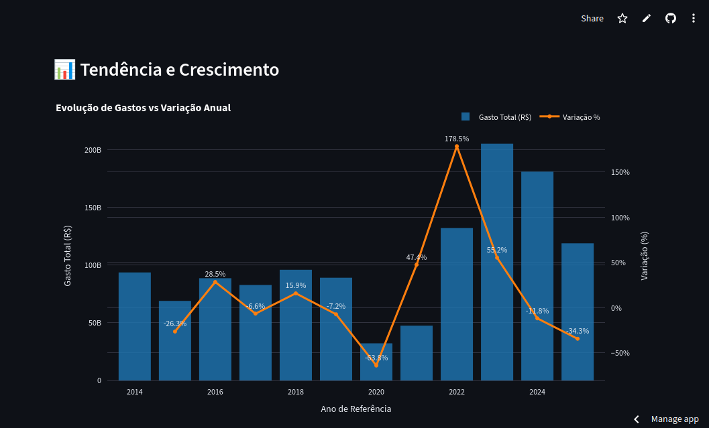
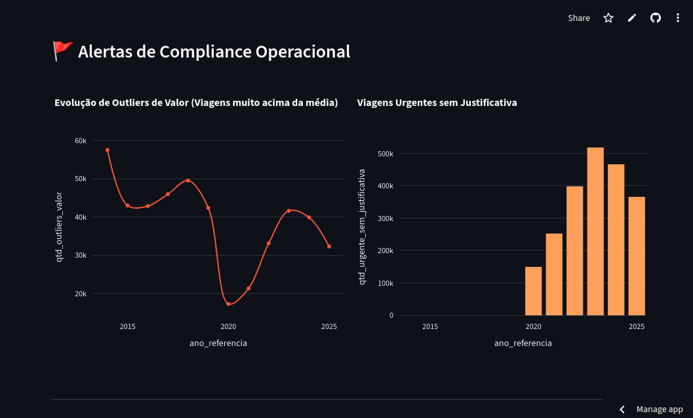
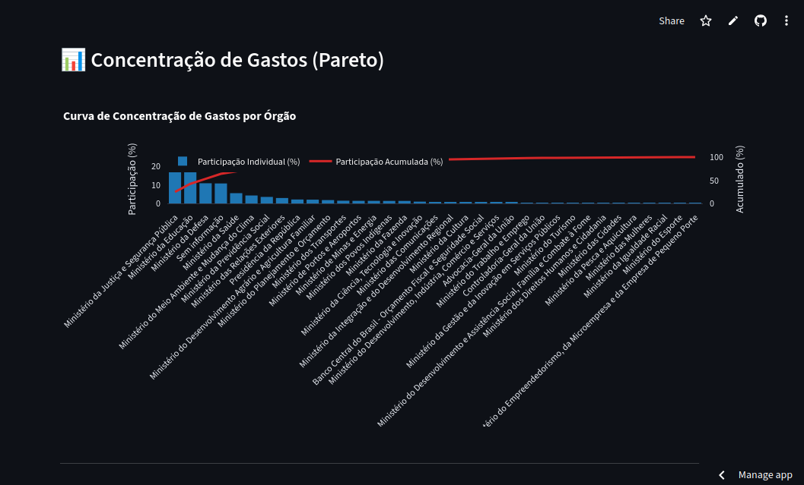
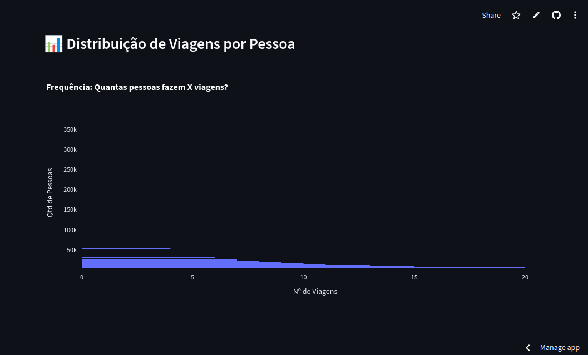

📊 GOVBR Travel Analytics — Azure Data Lake + Polars

Este repositório faz parte do ecossistema SIAV (Sistema Inteligente de Auditoria de Viagens). É um dashboard de Business Intelligence (BI) de alta performance desenvolvido para analisar dados de viagens do Governo Federal Brasileiro, processando desde indicadores estratégicos até uma massa de quase 1 milhão de registros de viajantes únicos.
🚀 Stack Tecnológica

    Linguagem: Python 3.13

    Engine de Dados: Polars (Escrita em Rust, foco em performance e Lazy Evaluation)

    Cloud Storage: Azure Data Lake Storage (ADLS Gen2)

    Frontend: Streamlit (Multipage App)

    Visualização: Plotly Express & Graph Objects

    Infraestrutura: Hospedado via Streamlit Community Cloud

🏗️ Arquitetura e Diferenciais Técnicos
1. Camada de Dados (Azure + Polars)

O projeto utiliza o protocolo az:// para acessar arquivos Parquet diretamente no Azure. O diferencial é o uso de LazyFrames, onde as queries são otimizadas antes da execução, reduzindo drasticamente o tráfego de rede e o uso de RAM.
2. Data Observability & Compliance

Diferente de dashboards comuns, este projeto inclui uma página de Auditoria que monitora:

    Qualidade Técnica: Percentual de IDs, órgãos e valores inválidos por ano.

    Alertas de Compliance: Identificação de outliers de valor e viagens urgentes sem justificativa.

3. Big Data no Edge

A página de Perfil de Viajantes processa 976.767 registros. Utilizando a engine de Streaming do Polars, realizamos agregações e buscas textuais em tempo real, otimizadas para hardware com limitações de recursos.
📂 Estrutura do Projeto
Plaintext

.
├── main.py                    # Dashboard Executivo (Home)
├── pages/                     # Páginas do Multipage App
│   ├── 01_Auditoria.py        # Qualidade de Dados e Alertas
│   ├── 02_Analise_Orgaos.py   # Rankings e Concentração (Pareto)
│   └── 03_Perfil_Viajantes.py # Processamento de Big Data (1M rows)
├── src/                       # Módulos de suporte e UI
│   ├── connector.py           # Abstração da conexão com Azure
│   ├── ui.py                  # Componentes visuais e CSS customizado
│   └── profiling.py           # Lógica de análise de perfil
└── docs/screenshots/          # Evidências de operação do sistema

📸 Interface do Dashboard (BI Analytics)

O dashboard oferece uma visão executiva e detalhada sobre o ciclo de gastos governamentais, permitindo drill-down por órgão e perfil de comportamento.
📈 Visão Geral e Tendências

Análise histórica de gastos e variações anuais, permitindo identificar picos de utilização de recursos.

⚖️ Auditoria e Conformidade

Módulo focado na identificação de outliers e viagens urgentes sem justificativa, alimentado pelo motor de IA do GOVBR-Data-Engine.

🏢 Análise por Órgão e Distribuição

Visualização da distribuição orçamentária entre as diferentes pastas do governo e perfis de gastos por categoria.

Desenvolvido por Rogério Oliveira | Engenharia de Dados & Analytics de Alta Performance.